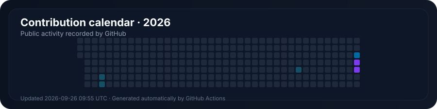

<!--
PROFILE GOVERNANCE
- Primary profile language: Spanish (README.md)
- Secondary language: English (README.en.md)
- Adaptive heroes: assets/header-{es,en}.svg + light variants
- Adaptive language controls: assets/language-{es,en}.svg + light variants
- Generated metric assets: assets/activity-{es,en}.svg + light variants (do not edit manually)
- Metric automation: .github/workflows/profile-metrics.yml
- Keep both language versions structurally aligned.
- Readability first: avoid  for body content and avoid multi-column prose.
- Editorial rule: Title Case for English category names, official product capitalization, lowercase generic skills in inline lists.
-->

  <picture>
    <source media="(prefers-color-scheme: dark)" srcset="./assets/header-en.svg">
    <source media="(prefers-color-scheme: light)" srcset="./assets/header-en-light.svg">
    
  </picture>

  <a href="./README.md" title="Switch to Spanish">
    <picture>
      <source media="(prefers-color-scheme: dark)" srcset="./assets/language-en.svg">
      <source media="(prefers-color-scheme: light)" srcset="./assets/language-en-light.svg">
      
    </picture>
  </a>

  <strong>Systems</strong> · <strong>Data Science</strong> · <strong>AI</strong> · <strong>Software</strong> · <strong>Databases</strong> · <strong>Infrastructure</strong> · <strong>Automation</strong>

  <a href="#about-me">About me</a>&nbsp;&nbsp;·&nbsp;&nbsp;
  <a href="#key-areas">Key areas</a>&nbsp;&nbsp;·&nbsp;&nbsp;
  <a href="#featured-projects">Projects</a>&nbsp;&nbsp;·&nbsp;&nbsp;
  <a href="#technical-stack">Technical stack</a>&nbsp;&nbsp;·&nbsp;&nbsp;
  <a href="#activity">Activity</a>

---

## About me

I am a technology professional with experience in <strong>systems and infrastructure</strong>, <strong>software development</strong>, <strong>databases</strong>, <strong>data analytics</strong>, and <strong>applied artificial intelligence</strong>. My profile combines technology operations with programming and specialized training in <strong>data science</strong>, allowing me to work from the infrastructure that supports a solution through the processing, analysis, and presentation of the information it generates.

I focus on building <strong>reproducible, documented, and maintainable solutions</strong>, automating repetitive processes, and turning data and operational problems into useful information, tools, and systems.

**What you will find here:** data science and analytics · local AI and emerging technologies · software and web development · databases and SQL · systems and infrastructure · automation.

## Key areas

- **Data Science & Analytics** — Data cleaning and transformation, exploratory analysis, statistics, visualization, Python, pandas, R, Shiny, and Power BI.
- **AI & Emerging Technologies** — Local AI, Ollama, language models, AI-assisted automation, and evaluation of emerging technologies.
- **Software & Web Development** — Web development, backend systems, APIs, general programming, and experimentation with different technologies.
- **Databases** — Data modeling, complex queries, procedures, integration, and administration of SQL Server, MariaDB, MySQL, and PostgreSQL.
- **Systems & Infrastructure** — Linux, Windows Server, Active Directory, networking, containers, on-premise services, monitoring, and operations.
- **Automation & Operations** — PowerShell, Bash, and Python applied to administration, integration, support, and process improvement.

## How I work

> **Understand the context → design with intent → analyze before assuming → automate what is repeatable → experiment responsibly → document and improve.**

## Featured projects

- **[SineOS](https://github.com/ArgenisPadill/SineOS)** — A reproducible personal environment for infrastructure, systems administration, development, automation, and local AI built on Debian GNU/Linux.  
  `Debian` · `Podman` · `PostgreSQL` · automation · monitoring · local AI

- **[Data Visualization with R and Shiny](https://github.com/ArgenisPadill/VisualizacionDeDatosConRyShiny)** — Data analysis and visualization using Mexico's ENIGH household survey and Mexico City Metro datasets.  
  `R` · `Shiny` · data analysis · visualization

- **[Multivariate Statistics](https://github.com/ArgenisPadill/EstadisticaMultiVariable)** — Statistical analysis exercises using the Iris dataset with Python and R.  
  `Python` · `R` · statistics · exploratory analysis · visualization

## Technical stack

<strong>View extended technical stack</strong>

 

**Data Science & Analytics**  
`Python` · `pandas` · `R` · `Shiny` · `Power BI` · statistics · data visualization

**AI & Emerging Technologies**  
`Ollama` · `Groq` · `Gemini` · `Perplexity` · local AI · language models · emerging technology experimentation

**Software & Web Development**  
`C#` · `.NET` · `ASP.NET` · `Java` · `Python` · web development · backend · APIs

**Databases**  
`SQL Server` · `MariaDB` · `MySQL` · `PostgreSQL` · data modeling · complex queries · reporting

**Systems & Infrastructure**  
`Debian` · `Fedora` · `Windows Server` · `Active Directory` · LAN · VLAN · MPLS · VPN · `Fortinet`

**Automation & Operations**  
`PowerShell` · `Bash` · `Python` · `Podman` · `Git` · `GitHub` · technical documentation · monitoring · troubleshooting

## Activity

<!-- METRICS_EN:START -->
### 170 contributions in 2026
**167 commits** · **6 active days** · **longest streak: 3 days**
<!-- METRICS_EN:END -->

  <picture>
    <source media="(prefers-color-scheme: dark)" srcset="./assets/activity-en.svg">
    <source media="(prefers-color-scheme: light)" srcset="./assets/activity-en-light.svg">
    
  </picture>

Activity is generated inside this repository and automatically refreshed with GitHub data.

<strong>Profile automation and maintenance</strong>

 

Metrics, the contribution calendar, and light/dark theme variants are updated automatically with **GitHub Actions**. The main content remains native Markdown to preserve readability, accessibility, and browser zoom compatibility.

---

  <em>More than work: commitment. More than words: results.</em>

