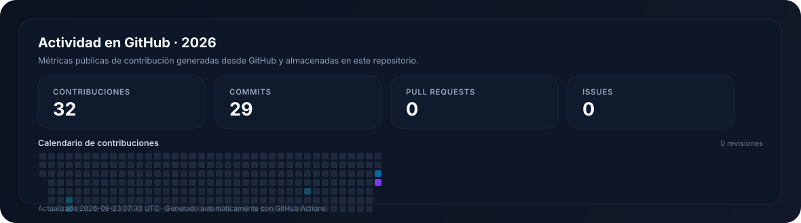

<!--
PROFILE GOVERNANCE
- Primary profile language: Spanish (README.md)
- Secondary language: English (README.en.md)
- Adaptive heroes: assets/header-{es,en}.svg + light variants
- Adaptive language controls: assets/language-{es,en}.svg + light variants
- Generated metric assets: assets/activity-{es,en}.svg + light variants (do not edit manually)
- Metric automation: .github/workflows/profile-metrics.yml
- Keep both language versions structurally aligned.
- Readability first: avoid  for body content and avoid multi-column prose.
- Editorial rule: localized category names, official product capitalization, sentence case for generic Spanish terms.
-->

  <picture>
    <source media="(prefers-color-scheme: dark)" srcset="./assets/header-es.svg">
    <source media="(prefers-color-scheme: light)" srcset="./assets/header-es-light.svg">
    
  </picture>

  <a href="./README.en.md" title="Cambiar a inglés">
    <picture>
      <source media="(prefers-color-scheme: dark)" srcset="./assets/language-es.svg">
      <source media="(prefers-color-scheme: light)" srcset="./assets/language-es-light.svg">
      
    </picture>
  </a>

  <strong>Sistemas</strong> · <strong>Ciencia de datos</strong> · <strong>IA</strong> · <strong>Software</strong> · <strong>Bases de datos</strong> · <strong>Infraestructura</strong> · <strong>Automatización</strong>

  <a href="#sobre-mi">Sobre mí</a>&nbsp;&nbsp;·&nbsp;&nbsp;
  <a href="#areas-clave">Áreas clave</a>&nbsp;&nbsp;·&nbsp;&nbsp;
  <a href="#proyectos-destacados">Proyectos</a>&nbsp;&nbsp;·&nbsp;&nbsp;
  <a href="#stack-tecnico">Stack técnico</a>&nbsp;&nbsp;·&nbsp;&nbsp;
  <a href="#actividad">Actividad</a>

---

## Sobre mí

Soy un profesional de tecnología con experiencia en <strong>sistemas e infraestructura</strong>, <strong>desarrollo de software</strong>, <strong>bases de datos</strong>, <strong>análisis de datos</strong> e <strong>inteligencia artificial aplicada</strong>. Mi perfil combina operación tecnológica con programación y una formación especializada en <strong>ciencia de datos</strong>, lo que me permite trabajar desde la infraestructura que soporta una solución hasta el procesamiento, análisis y presentación de la información que genera.

Me interesa construir soluciones <strong>reproducibles, documentadas y mantenibles</strong>, automatizar procesos repetitivos y convertir datos y problemas operativos en información, herramientas y sistemas útiles.

**En este GitHub encontrarás:** ciencia de datos y analítica · IA local y tecnologías emergentes · desarrollo de software y web · bases de datos y SQL · sistemas e infraestructura · automatización.

## Áreas clave

- **Ciencia de datos y analítica** — Limpieza y transformación de datos, análisis exploratorio, estadística, visualización, Python, pandas, R, Shiny y Power BI.
- **IA y tecnologías emergentes** — IA local, Ollama, modelos de lenguaje, automatización asistida y evaluación de herramientas emergentes.
- **Desarrollo de software y web** — Desarrollo web, backend, APIs, programación general y experimentación con distintas tecnologías.
- **Bases de datos** — Modelado, consultas complejas, procedimientos, integración y administración de SQL Server, MariaDB, MySQL y PostgreSQL.
- **Sistemas e infraestructura** — Linux, Windows Server, Active Directory, redes, contenedores, servicios on-premise, monitoreo y operación.
- **Automatización y operaciones** — PowerShell, Bash y Python aplicados a administración, integración, soporte y mejora de procesos.

## Forma de trabajo

> **Entender el contexto → diseñar con criterio → analizar antes de asumir → automatizar lo repetible → experimentar con responsabilidad → documentar y mejorar.**

## Proyectos destacados

- **[SineOS](https://github.com/ArgenisPadill/SineOS)** — Entorno personal reproducible para infraestructura, administración de sistemas, desarrollo, automatización e IA local sobre Debian GNU/Linux.  
  `Debian` · `Podman` · `PostgreSQL` · automatización · monitoreo · IA local

- **[Visualización de datos con R y Shiny](https://github.com/ArgenisPadill/VisualizacionDeDatosConRyShiny)** — Análisis y visualización de información utilizando datos de la ENIGH y del Sistema de Transporte Colectivo Metro.  
  `R` · `Shiny` · análisis de datos · visualización

- **[Estadística multivariable](https://github.com/ArgenisPadill/EstadisticaMultiVariable)** — Ejercicios de análisis estadístico con el conjunto de datos Iris utilizando Python y R.  
  `Python` · `R` · estadística · análisis exploratorio · visualización

## Stack técnico

<strong>Ver stack técnico ampliado</strong>

 

**Ciencia de datos y analítica**  
`Python` · `pandas` · `R` · `Shiny` · `Power BI` · estadística · visualización de datos

**IA y tecnologías emergentes**  
`Ollama` · `Groq` · `Gemini` · `Perplexity` · IA local · modelos de lenguaje · experimentación con herramientas emergentes

**Desarrollo de software y web**  
`C#` · `.NET` · `ASP.NET` · `Java` · `Python` · desarrollo web · backend · APIs

**Bases de datos**  
`SQL Server` · `MariaDB` · `MySQL` · `PostgreSQL` · modelado de datos · consultas complejas · reportes

**Sistemas e infraestructura**  
`Debian` · `Fedora` · `Windows Server` · `Active Directory` · LAN · VLAN · MPLS · VPN · `Fortinet`

**Automatización y operaciones**  
`PowerShell` · `Bash` · `Python` · `Podman` · `Git` · `GitHub` · documentación técnica · monitoreo · diagnóstico de incidentes

## Actividad

<!-- METRICS_ES:START -->
### 59 contribuciones en 2026
**56 commits** · **5 días activos** · **mejor racha: 2 días**
<!-- METRICS_ES:END -->

  <picture>
    <source media="(prefers-color-scheme: dark)" srcset="./assets/activity-es.svg">
    <source media="(prefers-color-scheme: light)" srcset="./assets/activity-es-light.svg">
    
  </picture>

La actividad se genera dentro de este mismo repositorio y se actualiza automáticamente con datos de GitHub.

<strong>Automatización y mantenimiento de este perfil</strong>

 

Las métricas, el calendario de contribuciones y sus variantes para tema claro y oscuro se actualizan automáticamente mediante **GitHub Actions**. El contenido principal permanece en Markdown nativo para conservar legibilidad, accesibilidad y compatibilidad con el zoom del navegador.

---

  <em>Más que trabajo: compromiso. Más que palabras: resultados.</em>

