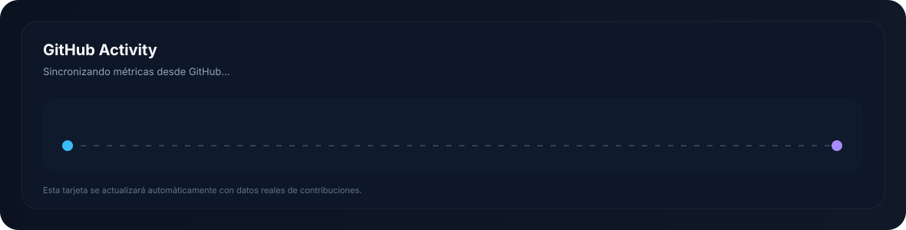

<!--
PROFILE GOVERNANCE
- Visible content: README.md
- Visual assets: assets/
- Generated metric asset: assets/activity.svg (do not edit manually)
- Metric automation: .github/workflows/profile-metrics.yml
- Keep the top-level narrative concise; detailed technologies belong in "Stack técnico".
-->

  

  <strong>Systems</strong> · <strong>Data Science</strong> · <strong>AI</strong> · <strong>Software</strong> · <strong>Databases</strong> · <strong>Infrastructure</strong> · <strong>Automation</strong>

  <a href="#sobre-mi">Sobre mí</a>&nbsp;&nbsp;·&nbsp;&nbsp;
  <a href="#areas-clave">Áreas clave</a>&nbsp;&nbsp;·&nbsp;&nbsp;
  <a href="#stack-tecnico">Stack técnico</a>&nbsp;&nbsp;·&nbsp;&nbsp;
  <a href="#actividad">Actividad</a>

---

## Sobre mí

<table>
<tr>
<td width="63%" valign="top">

Soy un profesional de tecnología con experiencia en <strong>sistemas e infraestructura</strong>, <strong>desarrollo de software</strong>, <strong>bases de datos</strong>, <strong>análisis de datos</strong> e <strong>inteligencia artificial aplicada</strong>.

Mi perfil combina operación tecnológica con programación y una formación especializada en <strong>Ciencia de Datos</strong>, lo que me permite trabajar desde la infraestructura que soporta una solución hasta el procesamiento, análisis y presentación de la información que genera.

Me interesa construir soluciones <strong>reproducibles, documentadas y mantenibles</strong>, automatizar procesos repetitivos y convertir datos y problemas operativos en información, herramientas y sistemas útiles.

</td>
<td width="37%" valign="top">
<h3>En este GitHub</h3>
<ul>
<li>Ciencia de datos y analítica</li>
<li>IA local y herramientas emergentes</li>
<li>Desarrollo web y backend</li>
<li>Bases de datos y SQL</li>
<li>Sistemas e infraestructura</li>
<li>Automatización</li>
</ul>
</td>
</tr>
</table>

## Áreas clave

<table>
<tr>
<td width="50%" valign="top"><strong>Data Science &amp; Analytics</strong> Limpieza, transformación, análisis exploratorio, estadística, visualización, Python, pandas, R, Shiny y Power BI.</td>
<td width="50%" valign="top"><strong>AI &amp; Emerging Tech</strong> IA local, Ollama, modelos de lenguaje, automatización asistida y evaluación de herramientas emergentes.</td>
</tr>
<tr>
<td valign="top"><strong>Software &amp; Web Development</strong> Desarrollo web, backend, APIs, programación general y experimentación con distintas tecnologías.</td>
<td valign="top"><strong>Databases</strong> Modelado, consultas complejas, procedimientos, integración y administración de SQL Server, MariaDB, MySQL y PostgreSQL.</td>
</tr>
<tr>
<td valign="top"><strong>Systems &amp; Infrastructure</strong> Linux, Windows Server, Active Directory, redes, contenedores, servicios on-premise, monitoreo y operación.</td>
<td valign="top"><strong>Automation &amp; Operations</strong> PowerShell, Bash y Python aplicados a administración, integración, soporte y mejora de procesos.</td>
</tr>
</table>

## Forma de trabajo

> **Entender el contexto → diseñar con criterio → analizar antes de asumir → automatizar lo repetible → experimentar con responsabilidad → documentar y mejorar.**

## Stack técnico

<strong>Ver stack técnico ampliado</strong>

 

**Data Science & Analytics**  
`Python` · `pandas` · `R` · `Shiny` · `Power BI` · estadística · visualización de datos

**AI & Emerging Tech**  
`Ollama` · IA local · modelos de lenguaje · `Groq` · `Gemini` · `Perplexity` · experimentación con herramientas emergentes

**Software Development**  
`C#` · `.NET / ASP.NET` · `Java` · `Python` · desarrollo web · backend · APIs

**Databases**  
`SQL Server` · `MariaDB` · `MySQL` · `PostgreSQL` · modelado · consultas complejas · reporteo

**Systems & Infrastructure**  
`Debian` · `Fedora` · `Windows Server` · `Active Directory` · LAN · VLAN · MPLS · VPN · Fortinet

**Automation & Tools**  
`PowerShell` · `Bash` · `Python` · `Podman` · `Git` · `GitHub` · documentación técnica · monitoreo · troubleshooting

## Actividad

  

La tarjeta de actividad se genera dentro de este mismo repositorio y se actualiza automáticamente. Esto evita depender de imágenes estadísticas de terceros.

---

  <em>Más que trabajo: compromiso. Más que palabras: resultados.</em>

